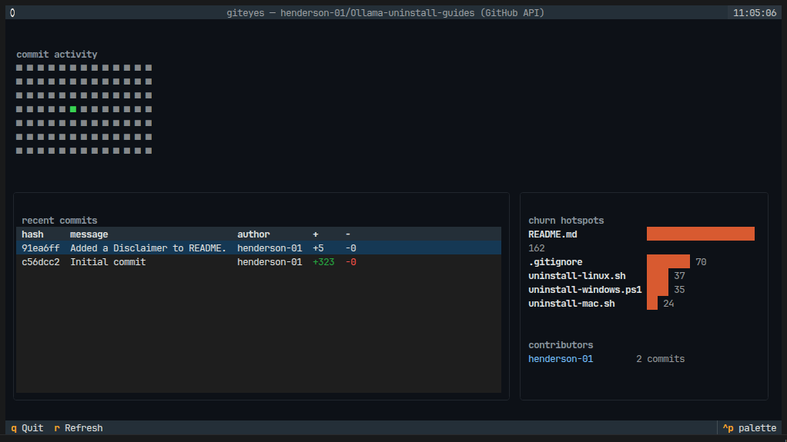
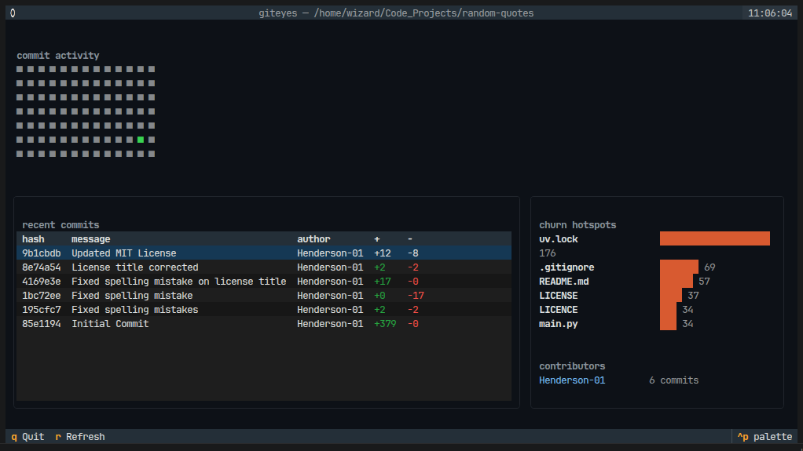

# giteyes

A terminal dashboard for exploring git commit activity. View commit heatmaps, recent commits, contributor rankings, and file churn hotspots all rendered live in your terminal.

**giteyes** works in two modes:

* **Local mode:** Point it at a repo already on your disk. No API keys, no network access; it reads the `.git` directory directly.
* **GitHub API mode:** Point it at `owner/repo` or a GitHub URL. It pulls the same dashboard straight from the GitHub REST API without cloning the repository.

## Quickstart (Near Zero Installation)

If you have [uv](https://docs.astral.sh/uv/) installed, you can run `giteyes` against **any** GitHub repo immediately, with absolutely no installation required. `uv` will download the tool into a throwaway environment, run it, and leave your system clean afterward:

```bash
uvx --from git+https://github.com/henderson-01/giteyes giteyes https://github.com/henderson-01/random-quotes

```

You can swap `henderson-01/random-quotes` for any `owner/repo`, a full URL, or a local file path.

> [!TIP]
> If you plan to use this often, set up a shell alias so you don't have to type the full git URL every time:
> `alias giteyes='uvx --from git+https://github.com/henderson-01/giteyes giteyes'`

### Running via a Local Clone

If you have already cloned the `giteyes` repository and want to run it without fully installing it, you can execute these commands from inside the `giteyes` directory:

**1. Pull a repo's stats via GitHub API (without cloning the target project):**

```bash
uvx --from . giteyes https://github.com/henderson-01/Ollama-uninstall-guides
```

* Screenshot via GitHub API with the cloned giteyes



**2. Run against another local project on your machine:**

```bash
uvx --from . giteyes ../random-quotes

```

*(This assumes your target project, `random-quotes`, is located in the same parent folder as `giteyes`.)*

* Screenshot via Local Clone 👆 UVX command random-quotes



## Installation (Local & Development)

To install `giteyes` locally for standard usage or development, we use `uv` to manage the environment and dependencies:

```bash
git clone https://github.com/henderson-01/giteyes.git
cd giteyes
uv sync

```

This automatically creates a `.venv`, locks your dependencies, and installs the project in editable mode.

## Usage

Because `uv` isolates the installation, how you run the command depends on where you are in your terminal.

### 1. Running from inside the `giteyes` directory

If you are currently inside your cloned `giteyes` folder, prefix your commands with `uv run`:

```bash
uv run giteyes                                                # Dashboard for the current directory
uv run giteyes /path/to/other-repo                            # Dashboard for a specific local repo
uv run giteyes henderson-01/random-quotes                     # Dashboard for an uncloned GitHub repo
uv run giteyes https://github.com/henderson-01/random-quotes  # Full URLs work too
uv run giteyes --weeks 26                                     # Show 26 weeks of heatmap history (default is 13)

```

### 2. Running from ANY directory on your machine

If you want to analyze a project without shifting your terminal back to the `giteyes` source folder, you can use `uvx` pointing to your local installation directory:

```bash
# CD into any project you want to explore
cd /path/to/your-target-project

# Run giteyes using the local source path
uvx --from /path/to/cloned/giteyes giteyes .

```

### 💡 Pro-Tip: Setup a Local Shell Alias

To make running `giteyes` globally seamless, add this alias to your shell profile (e.g., `~/.bashrc` or `~/.zshrc`):

```bash
alias giteyes="uvx --from /path/to/cloned/giteyes giteyes"

```

Once reloaded, you can simply `cd` into **any** git repository on your machine and type:

```bash
giteyes .

```

---

**Dashboard Controls:**

* `r` — Refresh data
* `q` — Quit

*Note: A local path is always checked first. Only targets that don't exist locally are parsed as GitHub references.*

---

### UV/UVX Clean Up

**Run this to clean up the uv/uvx cache from time to time:**

```bash
uv cache clean

```

### Terminal View Project Structure

*Should look something like this:*

```text
giteyes
├── CODE_OF_CONDUCT.md
├── CONTRIBUTING.md
├── giteyes
│   ├── __init__.py
│   ├── app.py
│   ├── app.tcss
│   ├── cli.py
│   ├── git_data.py
│   ├── models.py
│   ├── sources
│   │   ├── __init__.py
│   │   ├── github_api.py
│   │   └── local.py
│   └── widgets
│       ├── __init__.py
│       ├── commits.py
│       ├── contributors.py
│       ├── heatmap.py
│       └── hotspots.py
├── images
│   ├── Screenshot-API.png
│   └── Screenshot-Local.png
├── LICENSE
├── pyproject.toml
├── README.md
├── tests
│   ├── conftest.py
│   ├── test_app.py
│   ├── test_cli.py
│   ├── test_git_data.py
│   ├── test_github_api.py
│   └── test_heatmap_hover.py
└── uv.lock

```

### GitHub API Limits & Authentication

GitHub's unauthenticated REST API allows 60 requests per hour. Because each dashboard load makes roughly 15 requests, you will hit this limit quickly.

To raise your limit to 5,000 requests per hour, provide a [personal access token](https://github.com/settings/tokens) (no special scopes are needed for public repos):

```bash
# Pass it as an argument example
uv run giteyes henderson-01/random-quotes --token ghp_yourtokenhere

# Or export it as an environment variable
export GITHUB_TOKEN=ghp_yourtokenhere
uv run giteyes henderson-01/random-quotes

```

**API Limitation:** In GitHub API mode, churn hotspots are computed only from the ~20 most recent commits to save your rate limit. In Local mode, hotspots scan the last 200 commits directly from disk. Clone the repo and use Local mode if you need the deepest file churn history.

## Development

Running the test suite is handled smoothly through `uv`:

```bash
uv run pytest

```

Tests build a real throwaway git repo with scripted, dated commits (see `tests/conftest.py`), exercising the actual code paths without touching your broader filesystem. The Textual UI is tested headlessly via `App.run_test()`, making it CI-friendly. GitHub API mode is tested against a mocked session to avoid network calls and rate limits.

### Architecture

* `giteyes/git_data.py` Pure functions turning a `git.Repo` into plain data structures. Completely decoupled from the UI for easy testing.
* `giteyes/sources/` Contains the `DataSource` interface and its two implementations: `LocalGitSource` and `GitHubApiSource`. The UI only interacts with the interface, making the sources perfectly interchangeable.
* `giteyes/widgets/` Small Textual widgets, each responsible for rendering one specific piece of data (e.g., the heatmap or the commit table).
* `giteyes/app.py` The main Textual `App` that composes the widgets and wires them to the provided `DataSource`.
* `giteyes/cli.py` The Typer entrypoint. It decides whether to use Local or API mode based on the target string, then launches the app.

## License

MIT — see [LICENSE](/LICENSE)
