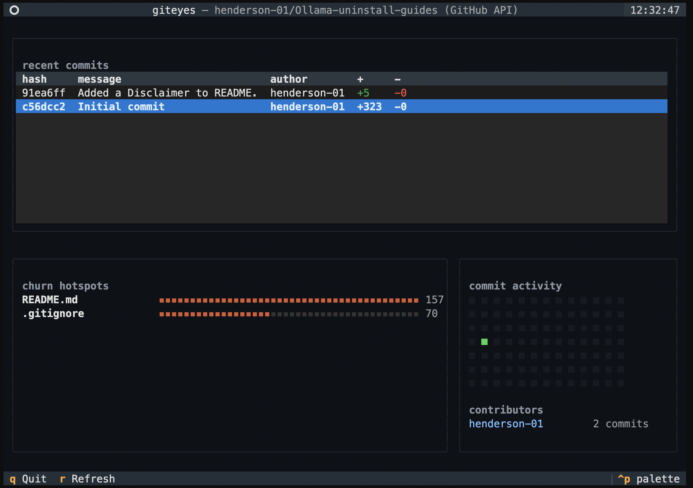
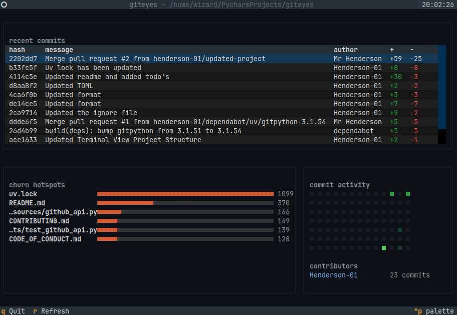

# giteyes 👀

A terminal dashboard for exploring git commit activity. View commit heatmaps, recent commits, contributor rankings, and file churn hotspots. The dashboard updates live as you select different commits from the commit list, all rendered directly in your terminal.

**giteyes** works in two modes:

* **Local mode:** Point it at a repo already on your disk. No API keys, no network access; it reads the `.git` directory directly.
* **GitHub API mode:** Point it at `owner/repo` or a GitHub URL. It pulls the same dashboard straight from the GitHub REST API without cloning the repository.

## Quickstart (Near Zero Installation)

If you have [uv](https://docs.astral.sh/uv/) installed, you can run `giteyes` against **any** GitHub repo immediately, with no permanent installation required. `uvx` runs the tool in an isolated environment:

```bash
uvx --from git+https://github.com/henderson-01/giteyes giteyes https://github.com/henderson-01/random-quotes
```

You can replace `henderson-01/random-quotes` with any `owner/repo`, a full GitHub URL, or a local file path.

> [!TIP]
> If you only use `giteyes occasionally`, `uvx` is the easiest option because it requires no permanent installation.

---

## Permanent Installation with `uv tool`

If you use `giteyes` regularly, you can install it as a persistent command-line tool:

```bash
uv tool install git+https://github.com/henderson-01/giteyes
```

Once installed, `giteyes` is available as a normal terminal command and can be run from **any directory**:

```bash
cd /path/to/your/project
giteyes .
```

You don't need to clone the `giteyes` repository or install it into each project.

You can also use it with GitHub repositories:

```bash
giteyes henderson-01/random-quotes
```

Or a full GitHub URL:

```bash
giteyes https://github.com/henderson-01/random-quotes
```

> [!NOTE]
> If `giteyes` isn't found after installation, make sure uv's tool executable directory is on your `PATH`. You can use `uv tool update-shell` to configure this automatically.

---

## Running via a Local Clone

If you have already cloned the `giteyes` repository and want to run it directly from the source, you can use `uvx --from .` from inside the `giteyes` directory.

**1. Pull a repo's stats via GitHub API (without cloning the target project):**

```bash
uvx --from . giteyes https://github.com/henderson-01/Ollama-uninstall-guides
```

*Screenshot via GitHub API with the cloned giteyes:*



**2. Run against another local project on your machine:**

```bash
uvx --from . giteyes ../giteyes
```

*(This assumes your target project is located in the same parent folder as `giteyes`.)*

*Screenshot via Local Clone:*



---

## Installation (Local & Development)

If you want to develop `giteyes` or run it directly from a local clone, use `uv` to manage the environment and dependencies:

```bash
git clone https://github.com/henderson-01/giteyes.git
cd giteyes
uv sync
```

This creates a `.venv`, synchronizes the dependencies from the lockfile, and installs the project in editable mode.

---

## Usage

### Running a locally cloned development version

If you are inside your cloned `giteyes` repository, use `uv run`:

```bash
uv run giteyes .                                             # Dashboard for the current directory
uv run giteyes /path/to/other-repo                           # Dashboard for a specific local repo
uv run giteyes henderson-01/random-quotes                    # Dashboard for an uncloned GitHub repo
uv run giteyes https://github.com/henderson-01/random-quotes # Full URLs work too
```

### Running the installed command

If you installed `giteyes` with `uv tool install`, you can run it directly from anywhere:

```bash
cd /path/to/your-target-project
giteyes .
```

No `uv run`, `uvx`, alias, or path to the `giteyes` source directory is required.

---

### Optional: Create a Shell Alias

If you prefer to use `uvx` without permanently installing `giteyes`, you can create a shell alias. This lets you type `giteyes` normally while `uvx` handles running the tool.

For Bash or Zsh, add the following to `~/.bashrc` or `~/.zshrc`:

```bash
alias giteyes="uvx --from git+https://github.com/henderson-01/giteyes giteyes"
```

Reload your shell configuration:

```bash
source ~/.bashrc
```

Or, if you're using Zsh:

```bash
source ~/.zshrc
```

You can then run:

```bash
cd /path/to/your/project
giteyes .
```

> [!NOTE]
> This is an alternative to `uv tool install`. The alias does not permanently install `giteyes`; it simply gives the `uvx` command a shorter name.

---

**Dashboard Controls:**

* `r` — Refresh data
* `q` — Quit

*Note: A local path is always checked first. Only targets that don't exist locally are parsed as GitHub references.*

---

## UV/UVX Cache Cleanup

You can occasionally clean uv's cache with:

```bash
uv cache clean
```

This removes cached packages and environments. They will be downloaded again when needed.

---

## GitHub API Limits & Authentication

GitHub's unauthenticated REST API allows 60 requests per hour. Because each dashboard load makes roughly 15 requests, you will hit this limit quickly.

To raise your limit to 5,000 requests per hour, provide a [personal access token](https://github.com/settings/tokens) (no special scopes are needed for public repos):

```bash
# Pass it as an argument
giteyes henderson-01/random-quotes --token ghp_yourtokenhere

# Or export it as an environment variable
export GITHUB_TOKEN=ghp_yourtokenhere
giteyes henderson-01/random-quotes

```

**API Limitation:** In GitHub API mode, churn hotspots are computed only from the ~20 most recent commits to save your rate limit. In Local mode, hotspots scan the last 200 commits directly from disk. Clone the repo and use Local mode if you need the deepest file churn history.

---

## Contributing & Development

Interested in building locally or learning more about the codebase structure? Check out [DEVELOPMENT.md](DEVELOPMENT.md) for testing and architecture details, and [CONTRIBUTING.md](CONTRIBUTING.md) for contribution guidelines.

---

## License

MIT — see [LICENSE](/LICENSE)
